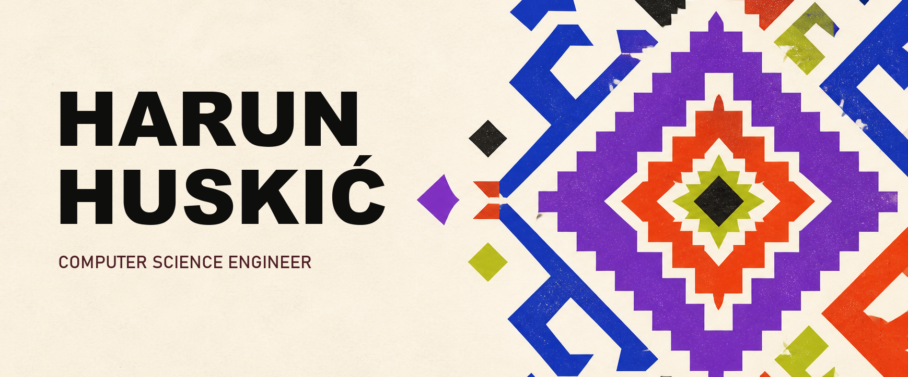

<div align="center">
  <a href="https://chillim.ba/">
    
  </a>
</div>

<div align="center">

[](https://chillim.ba/)
[](mailto:itsameharun@hmail.com)
[](https://www.linkedin.com/in/harun-huski%C4%87-baaa51152/)
[](https://maps.google.com/?q=Sarajevo)

</div>

## 01 / Zdravo — I'm Harun.

I'm a **Computer Science Engineer** building digital products across web, mobile, artificial intelligence, and interactive experiences. I combine strong engineering with clear visual direction—from React and Next.js applications to computer vision systems, cloud infrastructure, and creative production.

```text
engineering ─────────────┐
design ──────────────────┼──► useful digital experiences
artificial intelligence ─┤
creative technology ─────┘
```

### What I'm building now

- AI products that solve real, human problems
- Full-stack web applications with modern JavaScript technologies
- Mobile experiences with React Native
- Computer vision, machine learning, and local LLM experiments
- Digital products and creative direction through **Chillim Digital**

## 02 / Technology stack

### Web & mobile

<div align="center">


</div>

### AI, data & cloud

<div align="center">


</div>

### Tools & creative production

<div align="center">


</div>

## 03 / Contribution activity

<div align="center">
  <sub>Updated automatically from my GitHub contributions.</sub>
</div>

<br />

<picture>
  <source media="(prefers-color-scheme: dark)" srcset="https://raw.githubusercontent.com/harunhuskic/harunhuskic/output/github-contribution-grid-snake-dark.svg" />
  <source media="(prefers-color-scheme: light)" srcset="https://raw.githubusercontent.com/harunhuskic/harunhuskic/output/github-contribution-grid-snake.svg" />
  
</picture>

---

<div align="center">
  <sub><strong>ENGINEERING × DESIGN × AI</strong> · Sarajevo, Bosnia and Herzegovina</sub>
</div>
